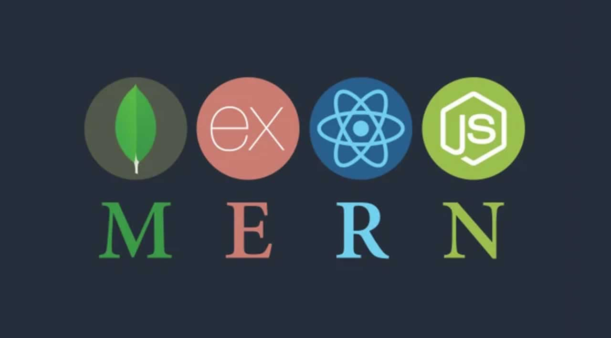
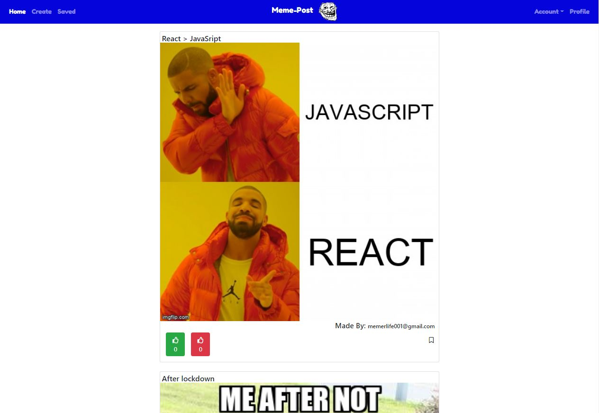
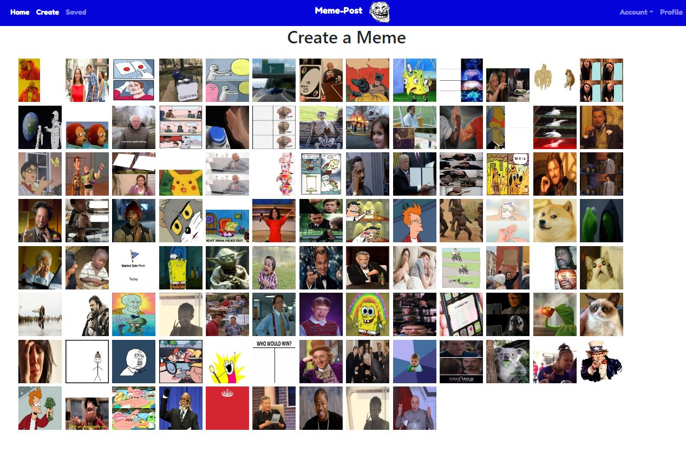
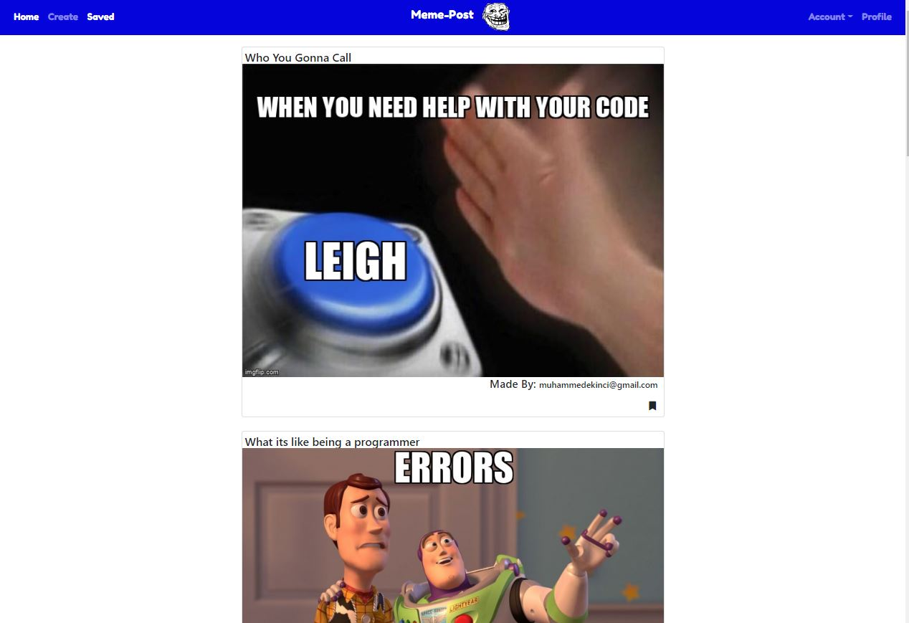
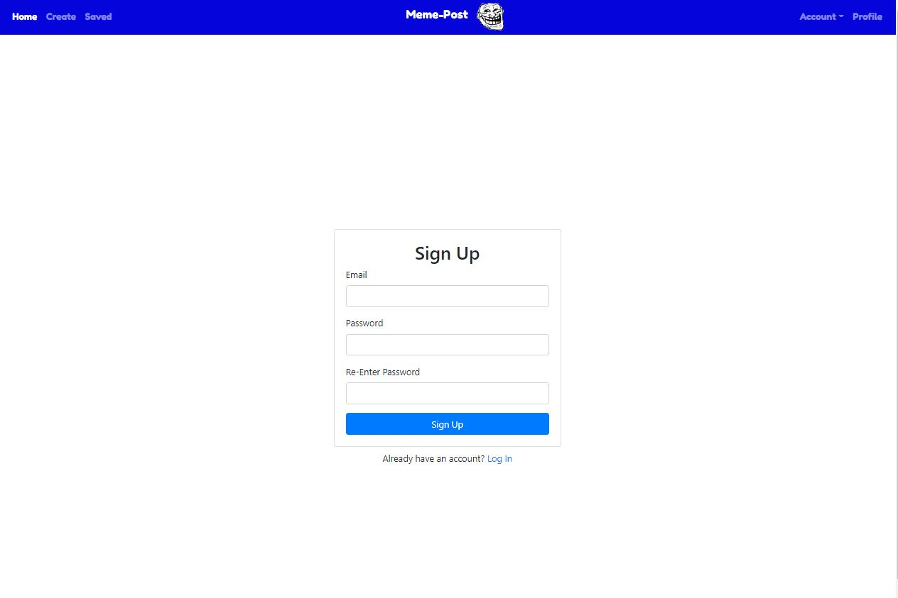

# Welcome To Meme-Post

An Application that allows you to create and post your own creative memes to your hearts content. If you find a meme that you cherish no problem you can just save it and if you feel like the meme is dead no problem just unsave it. Easy as that! 

## Usage

- ### Live usage:
 -deployed link: [Here](https://memepost.herokuapp.com/#/)

- #### Local Usage:
  - Git clone the repository.
  - From you terminal, run ```npm i``` to install the dependencies required for the application.
  - Run ```npm run seed``` to load the database.
  - Run ``` npm start``` to start the application on the localhost.

## Authors
### Muhammed Ekinci
 -[Github](https://github.com/MuhammedEkinci)
 -[Linkedin](https://www.linkedin.com/in/muhammed-ekinci-/)

### William May
 -[Github](https://github.com/1066JMay96)
 -[Linkedin]()

### Chad Smith
 -[Github]()
 -[Linkedin]()


## technologies


## Screenshots





## License

 &copy; 2020 Muhammed Ekinci, William May, Chad Smith
